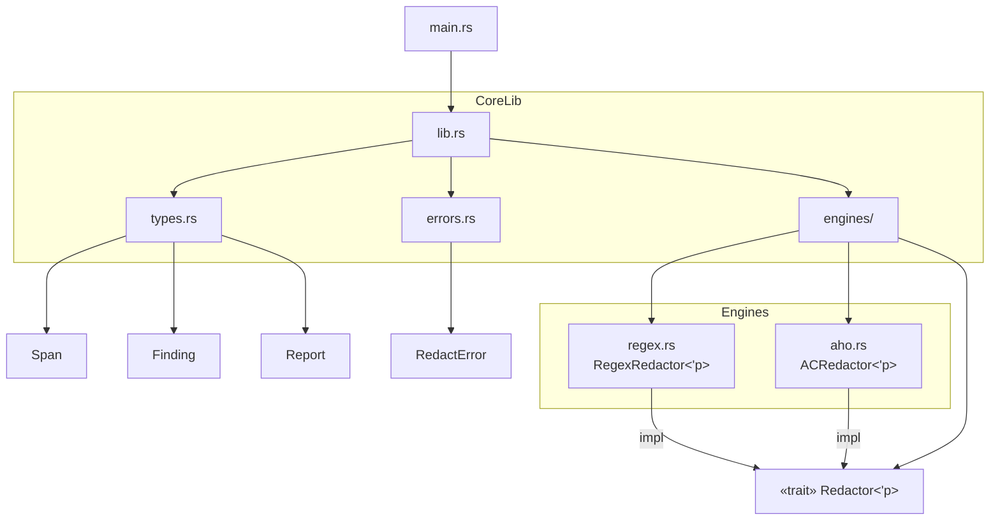

# redactr-rs

> A sample project that redacts sensitive information from text using different redaction engines in Rust.
> Made this to practice Rust ownership, collections, error handling, generics, traits, lifetimes, etc.

## Structure

